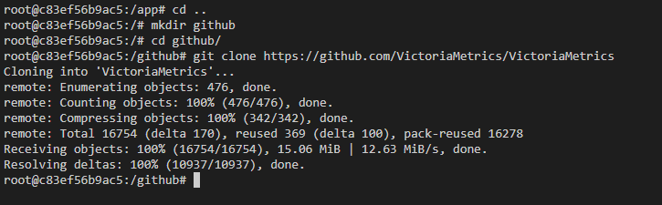
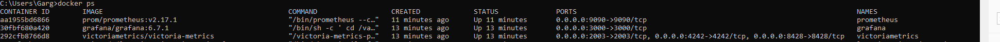

 

# Background

I wanted to learn how to setup VictoriaMetrics from a Container point of view to able to collect Prometheus metrics.


# What is VictoriaMetrics

> https://victoriametrics.com/
>
> Open source time series database and long-term remote storage for Prometheus
>
> VictoriaMetrics is fast, cost-effective and scalable time-series  database. It can be used as long-term remote storage for Prometheus. It is available in [binary releases](https://github.com/VictoriaMetrics/VictoriaMetrics/releases), [docker images](https://hub.docker.com/r/victoriametrics/victoria-metrics/) and in [source code](https://github.com/VictoriaMetrics/VictoriaMetrics). 

## Workspace container source

What is a Workspace Container? It's a isolated containerized environment that contains everything you need to be able to follow this article in the exact same way I did when creating this article.

https://github.com/geircode/learning-victoriametrics 


# Getting started

1. [Start the workspace container](#start-the-workspace-container)
2. [Attach Visual Studio Code to the running container](#attach-visual-studio-code-to-the-running-container)
3. [Start the VictoriaMetrics Container from within the workspace container](#start-the-victoriametrics-container-from-within-the-workspace-container)


## Start the workspace container

From within this Container we will do all VictoriaMetrics related stuff.

1. Start CMD/Powershell in Windows

2. Get the source code

```
git clone https://github.com/geircode/learning-victoriametrics 
cd learning-victoriametrics
```

3. Run the script “`docker-compose.build.all.bat`“ or “[docker-compose.build.all.sh](http://docker-compose.build.all.sh)“ if you are on Linux.

This will start container with the name “**learning_victoriametrics-1**“:


## Attach Visual Studio Code to the running container

1. Start Visual Studio Code the root folder of the repository

```
git clone https://github.com/geircode/learning-victoriametrics 
cd learning-victoriametrics 
code .
```

2. Install the proposed extensions

3. Attach to the already running workspace container


Find the container with the name “**learning_victoriametrics-1**“ and click it. This will install Visual Studio Code server into the  container and attach the Visual Studio Code client to this server.

4. Open /app folder


5. Install workspace extension recommendations, and reload


Congrats! You are now running a Visual Studio Code instance within a container.

## Start the VictoriaMetrics Container from within the workspace container

1. Start a terminal in Visual Studio Code


This will be equivalent to run this docker command manually:

```
docker exec -it learning_victoriametrics-1 /bin/bash
```


2. Run the “**docker-compose.up.sh**“ script


####

<details>
  <summary>How to build the **docker-compose** file. First try.</summary>

# How to build the **docker-compose** file

Actually, VictoriaMetrics has built their own. That's very nice. It means that this might be easy to setup.

Here is the docker-compose provided by VictoriaMetrics:

https://github.com/VictoriaMetrics/VictoriaMetrics/blob/master/deployment/docker/docker-compose.yml

When I try to run "docker-compose up" on this,... what will happen. Will it work immediately and flawlessly?

**<font color="red">Nope</font>**, and I got this error when trying to run "**docker-compose up**":

```bash
root@c83ef56b9ac5:/app/victoriametrics-service# docker-compose up -d

Creating network "victoriametrics_service_vm_net" with the default driver
Creating volume "victoriametrics_service_promdata" with default driver
Creating volume "victoriametrics_service_vmdata" with default driver
Creating volume "victoriametrics_service_grafanadata" with default driver
Creating victoriametrics ... done
Creating prometheus      ... error
Creating grafana         ... done

ERROR: for prometheus  Cannot start service prometheus: OCI runtime create failed: container_linux.go:349: starting container process caused "process_linux.go:449: container init caused \"rootfs_linux.go:58: mounting \\\"/app/victoriametrics-service/prometheus.yml\\\" to rootfs \\\"/var/lib/docker/overlay2/9c14a51dd9a0b2b56e029e704a7e5150e4de3595b778a10a83f48b119bb4b8c9/merged\\\" at \\\"/var/lib/docker/overlay2/9c14a51dd9a0b2b56e029e704a7e5150e4de3595b778a10a83f48b119bb4b8c9/merged/etc/prometheus/prometheus.yml\\\" caused \\\"not a directory\\\"\"": unknown: Are you trying to mount a directory onto a file (or vice-versa)? Check if the specified host path exists and is the expected type

ERROR: for prometheus  Cannot start service prometheus: OCI runtime create failed: container_linux.go:349: starting container process caused "process_linux.go:449: container init caused \"rootfs_linux.go:58: mounting \\\"/app/victoriametrics-service/prometheus.yml\\\" to rootfs \\\"/var/lib/docker/overlay2/9c14a51dd9a0b2b56e029e704a7e5150e4de3595b778a10a83f48b119bb4b8c9/merged\\\" at \\\"/var/lib/docker/overlay2/9c14a51dd9a0b2b56e029e704a7e5150e4de3595b778a10a83f48b119bb4b8c9/merged/etc/prometheus/prometheus.yml\\\" caused \\\"not a directory\\\"\"": unknown: Are you trying to mount a directory onto a file (or vice-versa)? Check if the specified host path exists and is the expected type
ERROR: Encountered errors while bringing up the project.
root@c83ef56b9ac5:/app/victoriametrics-service# 
```

It seems that I am missing the file "**prometheus.yml**". Ok, it seems that the docker-compose file is mounting alot of external files into the container.

What if I git clone https://github.com/VictoriaMetrics/VictoriaMetrics and try to run "docker-compose up" on the original place?

1. **git clone** inside the workspace container



2. Run "**docker-compose up**" on https://github.com/VictoriaMetrics/VictoriaMetrics/blob/master/deployment/docker/docker-compose.yml

Usually, this is a good test to see if the implementation has been tested continuously alot of times on different machines and environments.

**<font color="red">Nope</font>**, I got the same error. 

3. Trying to comment out the prometheus.yml mount.

That worked. Well, the containers are running without error, but VictoriaMetrics endpoint is not responding.

These endpoints are starting up:

 <table style="width:100%">
  <tr>
    <th>Service</th>
    <th>Endpoint</th>
  </tr>
  <tr>
    <td>Prometheus</td>
    <td>http://localhost:9090/graph</td>
  </tr>
  <tr>
    <td>Grafana</td>
    <td>http://localhost:3000</td>
  </tr>
  <tr>
    <td>Grafana</td>
    <td>http://localhost:2003</td>
  </tr>
  <tr>
    <td>Grafana</td>
    <td>http://localhost:4242</td>
  </tr>
  <tr>
    <td>Grafana</td>
    <td>http://localhost:8484</td>
  </tr>
</table> 



... and now I found this guide => https://github.com/VictoriaMetrics/VictoriaMetrics/wiki/Single-server-VictoriaMetrics

Restarting...

</details>


## How to build the **docker-compose** file


## Problems and hickups discovered during the development of this article

- **No default shell installed in the container**

For some reason, VictoriaMetrics has choosen another shell for their container... Why.

```
docker exec -it victoriametrics_service-1 /bin/sh
docker exec -it victoriametrics_service-1 /bin/bash
```

Aha, it's because they wanted the image supersmall. The image I have is just 14MB big.

https://medium.com/@valyala/stripping-dependency-bloat-in-victoriametrics-docker-image-983fb5912b0d

This also means that it's not possible to open a terminal into the container just to see what is actually stored there and how the filestructure is setup.


- **No "single source of truth" Dockerfile**

They actually build the container image by scripts explicit rather having a Dockerfile do this 'declaratively'. Meaning, a Dockerfile always creates the same image each time while a script that first spin a container and then install a lot of stuff and then commit the image??

This means that you can not be sure what Image you are running, because it's based on some volatile scripts instead of using a simple Dockerfile.

https://github.com/VictoriaMetrics/VictoriaMetrics/blob/master/deployment/docker/Makefile

Sure, it works. But other folks can not simply download the Dockerfile and build it themselves. Where is the Docker Container for running the makefile script?

- **Had to install GO because I needed to create an image with a shell**

```dockerfile
# Golang
ENV GOLANG_VERSION 1.14.2
RUN curl -fL https://storage.googleapis.com/golang/go$GOLANG_VERSION.linux-amd64.tar.gz -o go.linux-amd64.tar.gz
RUN tar -xzf go.linux-amd64.tar.gz -C /usr/local
ENV PATH /usr/local/go/bin:$PATH
RUN go version
```

To able to set the **PATH** variable, it can not be set by the **RUN** command and "export" because this will only affect Docker builder. It needs to be set by the "**ENV**" command to persist into the container and make GO available on the commandline.


# Resources

- https://victoriametrics.com/
- https://victoriametrics.github.io
- https://github.com/VictoriaMetrics/VictoriaMetrics
- https://hub.docker.com/u/victoriametrics
