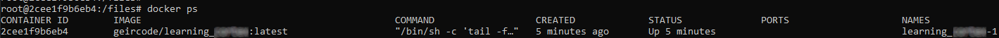
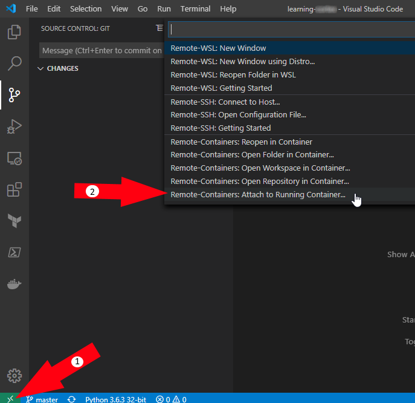
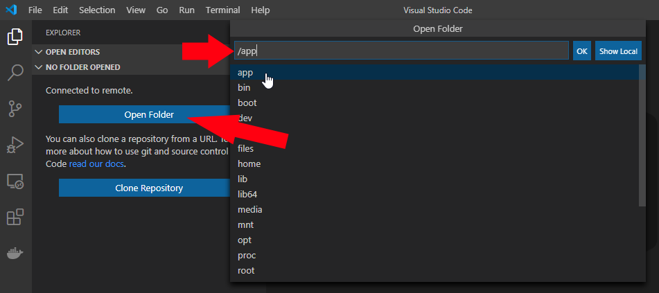
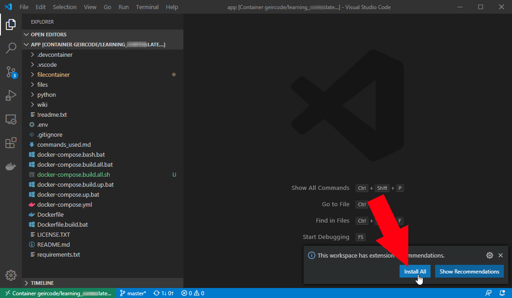
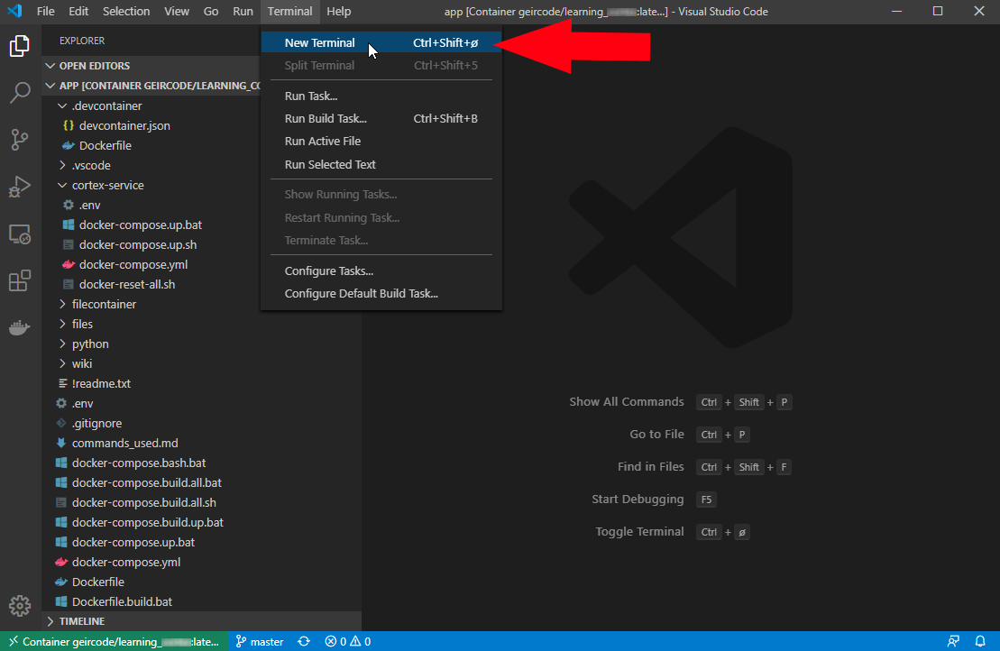
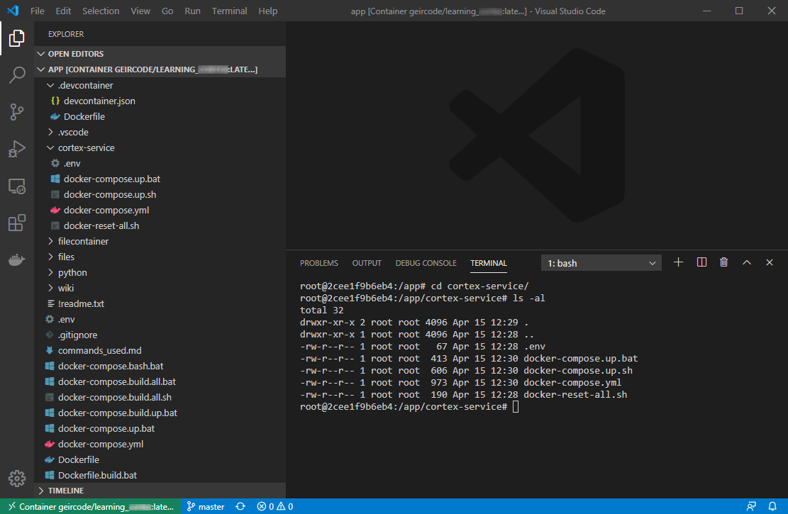

 

# Background

I wanted to learn how to setup VictoriaMetrics from a Container point of view to able to collect Prometheus metrics.


# What is VictoriaMetrics

> https://victoriametrics.com/
>
> Open source time series database and long-term remote storage for Prometheus
>
> VictoriaMetrics is fast, cost-effective and scalable time-series  database. It can be used as long-term remote storage for Prometheus. It is available in [binary releases](https://github.com/VictoriaMetrics/VictoriaMetrics/releases), [docker images](https://hub.docker.com/r/victoriametrics/victoria-metrics/) and in [source code](https://github.com/VictoriaMetrics/VictoriaMetrics). 


## Workspace container source

https://github.com/geircode/learning-victoriametrics 


# Getting started

1. [Start the workspace container](#Start the workspace container)
2. [Attach Visual Studio Code to the running container](#Attach Visual Studio Code to the running container)
3. [Start the VictoriaMetrics Container from within the workspace container](#Start the VictoriaMetrics Container from within the workspace container)


## Start the workspace container

From within this Container we will do all VictoriaMetrics related stuff.

1. Start CMD/Powershell in Windows

2. Get the source code

```
git clone https://github.com/geircode/learning-victoriametrics 
cd learning-victoriametrics
```

3. Run the script “`docker-compose.build.all.bat`“ or “[docker-compose.build.all.sh](http://docker-compose.build.all.sh)“ if you are on Linux.

This will start container with the name “**learning_victoriametrics-1**“:




## Attach Visual Studio Code to the running container

1. Start Visual Studio Code the root folder of the repository

```
git clone https://github.com/geircode/learning-victoriametrics 
cd learning-victoriametrics 
code .
```

2. Install the proposed extensions

3. Attach to the already running workspace container



Find the container with the name “**learning_victoriametrics-1**“ and click it. This will install Visual Studio Code server into the  container and attach the Visual Studio Code client to this server.

4. Open /app folder



5. Install workspace extension recommendations, and reload



Congrats! You are now running a Visual Studio Code instance within a container.

## Start the VictoriaMetrics Container from within the workspace container

1. Start a terminal in Visual Studio Code



This will be equivalent to run this docker command manually:

```
docker exec -it learning_victoriametrics-1 /bin/bash
```



2. Run the “**docker-compose.up.sh**“ script


####

# How to build the **docker-compose** file

This build is dased on the docs here => https://victoriametricsmetrics.io/docs/getting-started/getting-started-blocks-storage/, and the docker images provided directly from the [**victoriametricsproject**](https://hub.docker.com/u/victoriametricsproject)..


####

# Resources

- https://victoriametricsmetrics.io/
- https://github.com/victoriametricsproject/victoriametrics

# answer-22
